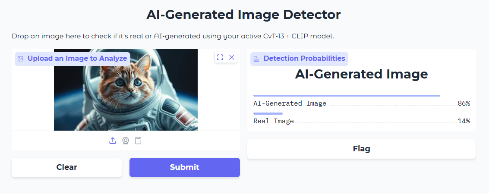

# AI-Generated Image Detection using CvT-13 and CLIP

## Overview

This project investigates the use of a hybrid deep learning architecture for detecting AI-generated images. The proposed model combines:

- CvT-13 (Convolutional Vision Transformer)
- CLIP ViT-B/32 (Contrastive Language-Image Pretraining)

Features extracted from both models are fused and passed through a classification head to determine whether an image is:

- REAL
- AI-Generated

The project was developed in Google Colab using PyTorch and includes a Gradio interface for image testing.

---

## Dataset

### CIFAKE Dataset

The model is trained and evaluated on the CIFAKE dataset containing:

- Real images
- AI-generated images

Dataset source:

https://www.kaggle.com/datasets/birdy654/cifake-real-and-ai-generated-synthetic-images

---

## Model Architecture

```text
Input Image (224×224)
        │
        ├── CvT-13
        │
        ├── CLIP ViT-B/32
        │
        ▼
 Feature Fusion
        │
        ▼
 Fully Connected Layers
        │
        ▼
 Binary Classification
 (REAL / FAKE)
```

### Components

#### CvT-13

- Extracts hierarchical visual features
- Combines convolutional operations with transformers
- Captures local and global image information

#### CLIP ViT-B/32

- Provides semantic image representations
- Pretrained on large-scale image-text pairs
- Helps detect high-level image inconsistencies

#### Fusion Classifier

- Concatenates CvT and CLIP embeddings
- Uses fully connected layers for classification

---

## Technologies Used

- Python
- PyTorch
- Hugging Face Transformers
- OpenAI CLIP
- Gradio
- Scikit-Learn
- Matplotlib

---

## Training Configuration

| Parameter | Value |
|------------|---------|
| Optimizer | AdamW |
| Learning Rate | 1e-4 |
| Batch Size | 16 |
| Epochs | 3 |
| Loss Function | BCEWithLogitsLoss |

---

## Features

- CvT + CLIP feature fusion
- Binary AI image detection
- Performance evaluation
- Confusion matrix generation
- Single image prediction
- External image testing
- Gradio web interface

---

## Results

The proposed CvT-13 + CLIP fusion model was evaluated on the CIFAKE test set containing 20,000 images (10,000 real and 10,000 AI-generated).

### Overall Performance

| Metric | Score |
|----------|----------|
| Accuracy | 96.80% |
| Precision (REAL) | 98.76% |
| Recall (REAL) | 94.80% |
| F1-Score (REAL) | 96.74% |
| Precision (FAKE) | 95.00% |
| Recall (FAKE) | 98.81% |
| F1-Score (FAKE) | 96.87% |

### Classification Report

| Class | Precision | Recall | F1-Score |
|---------|---------|---------|---------|
| REAL | 0.9876 | 0.9480 | 0.9674 |
| FAKE | 0.9500 | 0.9881 | 0.9687 |

### Confusion Matrix

| Actual / Predicted | REAL | FAKE |
|-------------------|-------|-------|
| REAL | 9,480 | 520 |
| FAKE | 119 | 9,881 |

### Key Findings

- Achieved **96.80% overall accuracy** on the CIFAKE benchmark.
- Demonstrated strong detection capability for AI-generated images with **98.81% recall**.
- Produced only **119 false negatives**, meaning very few AI-generated images were incorrectly classified as real.
- Maintained balanced performance across both classes with F1-scores above **96%**.

## Additional Analysis

### Prediction Score Distribution

The model produces well-separated probability distributions for real and AI-generated images.

| Class | Average Predicted Fake Probability |
|---------|---------|
| REAL | 0.0718 |
| FAKE | 0.9784 |

This indicates strong confidence in distinguishing between real and synthetic images, with minimal overlap between the two classes.

### Random Sample Verification

A random sample of 20 CIFAKE test images was evaluated:

- Correct Predictions: 18
- Incorrect Predictions: 2
- Sample Accuracy: 90%

Examples:

| Ground Truth | Prediction | Fake Probability |
|--------------|------------|------------------|
| REAL | REAL | 0.000002 |
| FAKE | FAKE | 0.999983 |
| REAL | FAKE | 0.742965 |
| FAKE | REAL | 0.042084 |

The model generally assigns very low fake probabilities to real images and very high fake probabilities to AI-generated images.


### External Image Evaluation

The model was tested on a small set of external images outside the CIFAKE dataset.

Results showed successful detection of AI-generated images; however, real-world photographs were incorrectly classified as AI-generated. This suggests that while the model performs strongly on the CIFAKE benchmark, further evaluation on diverse real-world datasets is required to assess generalization performance.

### Gradio Interface




---

## Installation

Install dependencies:

```bash
pip install -r requirements.txt
```

---

## Running the Project

Open the notebook in Google Colab:

```text
AI_Image_Detector.ipynb
```

Run all cells sequentially.

The notebook will:

1. Download the CIFAKE dataset
2. Load pretrained CvT and CLIP models
3. Train the fusion model
4. Evaluate performance
5. Launch a Gradio interface

---

## Google Colab Notes

This project was developed in Google Colab.

Some file paths are configured for Google Drive storage and may need to be modified before execution:

```python
/content/drive/MyDrive/
```

---

## Repository Structure

```text
.
├── AI_Image_Detector.ipynb
├── README.md
├── requirements.txt
└── .gitignore
```

---

## Future Work

- Evaluate on additional AI-image datasets
- Improve confidence calibration

---
